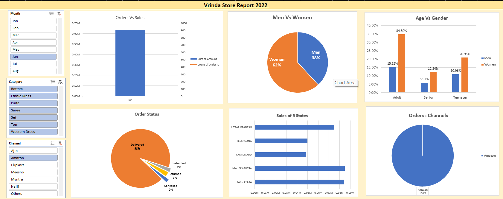

# Vrinda_Store_Sales_Analysis
Excel based sales data analysis and interactive dashboard for Vrinda Store using 31,048 sales records from 2022

## 📌 Project Overview

Vrinda Store wants to create an annual sales report for 2022 to understand customer behavior and identify opportunities to increase sales in 2023.

This project analyzes 31,048 sales records using Microsoft Excel to identify sales trends, customer segments, top-performing states, sales channels, and order status.

## 🛠️ Tools & Techniques

- Microsoft Excel
- Data Cleaning
- Excel Filters
- Find & Replace
- Excel Formulas
- PivotTables
- PivotCharts
- Slicers
- Data Visualization
- Business Analysis

## 🧹 Data Cleaning

The dataset was cleaned and prepared before performing the analysis.

- Checked for null/blank values using Excel filters.
- Standardized inconsistent Gender values.
- Replaced `M` with `Men`.
- Replaced `W` with `Women`.
- Checked the dataset for inconsistent values.

## ⚙️ Data Processing

### Age Group

Created customer age groups using Excel formulas:

- Teenager
- Adult
- Senior

### Month

Extracted month names from the date column to analyze monthly sales trends.

## 📊 Data Analysis

PivotTables and PivotCharts were used to analyze:

- Monthly sales performance
- Gender-wise sales
- Age-group performance
- State-wise sales
- Sales-channel performance
- Order status

## 📈 Interactive Dashboard

An interactive Excel dashboard was created using PivotCharts and Slicers.

The dashboard allows users to analyze sales performance based on different customer and sales dimensions.

### Dashboard Preview

## 🔍 Key Insights

1. March recorded the highest number of sales/orders.
2. Most orders were successfully delivered.
3. Women represented a larger share of buyers.
4. Women and Adult customers were the primary customer segments.
5. Amazon generated the highest number of sales/orders among the analyzed channels.
6. Maharashtra, Karnataka and Uttar Pradesh were the top three states.

## 💡 Business Recommendation

Based on the analysis, Vrinda Store should primarily target women aged 30–49 in Maharashtra, Karnataka and Uttar Pradesh.

The store can use targeted advertisements, discounts and promotional offers through high-performing sales channels such as Amazon, while also focusing on other major channels such as Flipkart and Myntra.

## 📁 Project Files

- `Vrinda_Store_Sales_Analysis.xlsx` — Complete Excel analysis and dashboard.
- `screenshots/` — Project screenshots and dashboard preview.

## 📌 Dataset

The dataset contains 31,048 sales records from 2022 and was used for analyzing customer behavior and sales performance.
